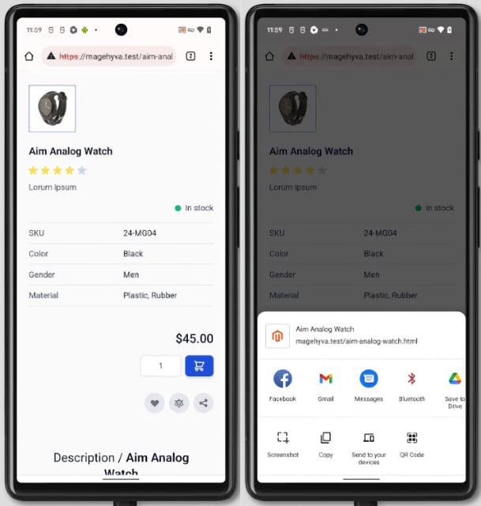
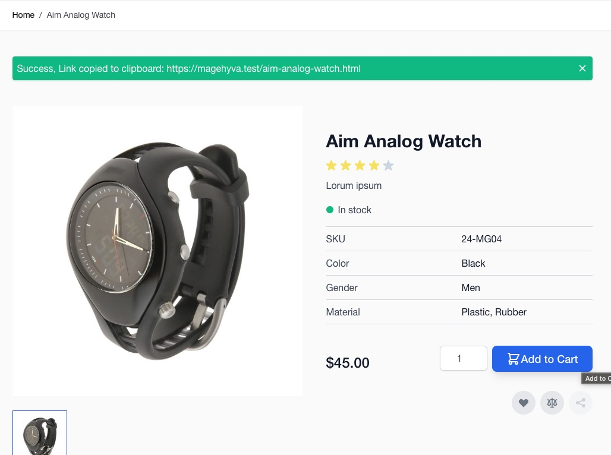

# Siteation - Magento 2 Module Share

[](https://packagist.org/packages/siteation/magento2-module-share)

[](https://hyva.io/)


This Magento 2 module adds the option to share you product,
using the Share API with an fallback to the Clipboard API for unsupported browsers.

## Installation

Install the package via;

```bash
composer require siteation/magento2-module-share
bin/magento setup:upgrade
```

> **Note**
> 
> This Module requires Magento 2.4 or higher and Hyvä Theme!
> For more requirements see the `composer.json`.

## How to use

This module is enabled by default.

If you want to disable it, for a specific store view.

Please navigate to Stores -> Configuration -> Catalog -> Share

### Preview



**Fallback**


